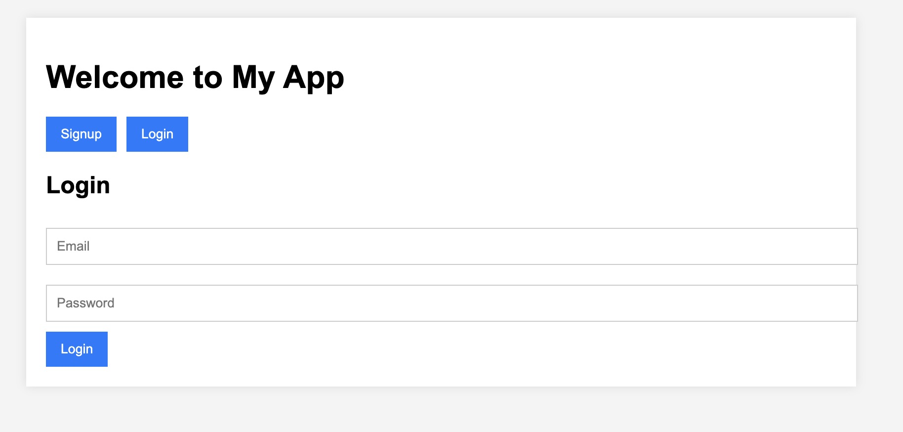

# Backend Engineering: Multisig Assignment

## part 1. Postgres Database and Login:

- Create a PostgresSQL database to store user information such as name
and email.
- Develop a login system that allows users to sign up and assigns them an
internal login ID.
- Implement a bonus feature to allow users to connect their Metamask
wallet.

When we start our node server we will be greeted by this screen, we will have option to login or signup

This is how login and signup page will look like upon clicking
<!--   -->

  
  

  
button which will connet to your metabase wallet

  
  

 

#### our database table of users

### A glimps of what whole thing look like 

## 2. Multisignature Process:

- Develop a multi-signature process where a user can create a process that requires sign-offs from five other users.

- Allow the user to choose the five other users from a dropdown list and send email notifications to each user when a new process is created.

- Add the functionality for users to add comments and upload a mandatory picture during the sign-off process.

- Allow the process creator to select which users can see the comments.
### this can be seen in first screenshot, while creating porocess user will have option to hide comment or make them visible

- Ensure the process creator receives a notification on their page when anyone signs off, and notify all parties involved via email when everyone
signs off.

- The same Postgres db can be used for this process as well.