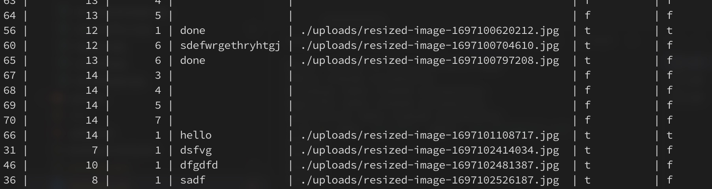

# Backend Engineering: Multisig Assignment

## part 1. Postgres Database and Login:

- Create a PostgresSQL database to store user information such as name
and email.
- Develop a login system that allows users to sign up and assigns them an
internal login ID.
- Implement a bonus feature to allow users to connect their Metamask
wallet.

When we start our node server we will be greeted by this screen, we will have option to login or signup


This is how login and signup page will look like upon clicking
<!--   -->


<div style="display: flex;">
  
  
</div>
 <br>
button which will connet to your metabase wallet

<div style="display: flex;">
  
  
</div>
<br>

#### our database table of users


### A glimps of what whole thing look like 


## 2. Multisignature Process:

- Develop a multi-signature process where a user can create a process that requires sign-offs from five other users.

- Allow the user to choose the five other users from a dropdown list and send email notifications to each user when a new process is created.

- Add the functionality for users to add comments and upload a mandatory picture during the sign-off process.

- Allow the process creator to select which users can see the comments.
  - this can be seen in first screenshot, while creating porocess user will have option to hide comment or make them visible

- Ensure the process creator receives a notification on their page when anyone signs off, and notify all parties involved via email when everyone
signs off.


### when ever someone signs off any process creator will receive such notification, creator will see all unread notifications at time of login, and once he clicks notification will disappear and will be marked as read


### 3. API:
- Break down the multi-signature process into REST APIs.
- Ensure that the APIs can be integrated into any webpage.

## rest api's are being used for every process, and have been integrated with web page

## some other things those are added.

### user will see all process created by him


### user will aslo be able to see all process signed of by him, as a reference of what he signed


## Database
 - we are using 4 tables here
 

 - user table will have user data 
 

  - process table will have process data 
 

  - signoff table will have data like process id, userid comment, imagepath, signedof, can see comment  
 
  

  - notification table will have data like user id, process id message being sent and read/unread
 

 - whenever user login if status is unread, he will see notification of those messages on his dashboard


## Few imp things 
-  i was using docker postgres here
```
docker run --name some-postgres -e POSTGRES_PASSWORD=mysecretpassword -p 5432:5432 -d postgres
```

### you will be needing some files/ folders in like, which u can see in .gitignore
  - .env
  - /upload
- .env will look like this
  - DB_USER=
  - DB_HOST=
  - DB_NAME=
  - DB_PASSWORD=
  - DB_PORT=
  - SMTP_HOST=
  - SMTP_PORT=
  - SMTP_USER=
  - SMTP_PASS=
- for emailing i have used this `Ethereal Email` for more `https://ethereal.email/`

 ### And did i mention we even have a logout here(top right) 👉🏻👈🏻

 

